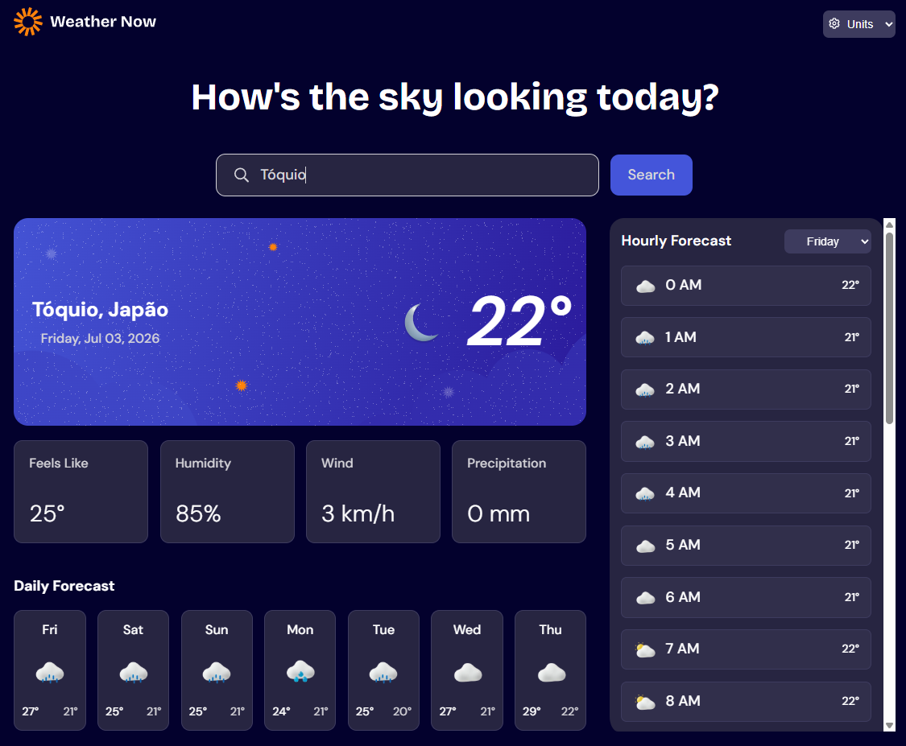
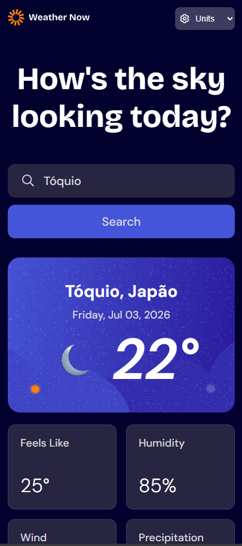

# 🌤️ Weather App

Aplicação de previsão do tempo com busca de cidades do mundo todo, construída com HTML, CSS e JavaScript vanilla. Solução para o desafio [Weather App do Frontend Mentor](https://www.frontendmentor.io/challenges/weather-app-K1FhddVm49).

🔗 **[Ver o projeto no ar](https://vinicius-novais.github.io/Weather-App/)**




## ✨ Funcionalidades

- Busca de qualquer cidade do mundo
- Condições atuais: temperatura, sensação térmica, umidade, vento e precipitação
- Previsão diária para os próximos 7 dias, com ícones por condição do tempo
- Previsão hora a hora (24h) com seletor para navegar entre os dias da semana
- Ícone de dia/noite conforme o horário local da cidade pesquisada
- Data formatada no fuso horário correto de cada cidade
- Telas de estado: loading com efeito skeleton, cidade não encontrada e erro de API com botão de tentar novamente

## 🛠️ Tecnologias

- **HTML5** e **CSS3** — layout responsivo e efeito skeleton de carregamento
- **JavaScript** — Fetch API com async/await, manipulação do DOM e gerenciamento de estados da interface
- **[Open-Meteo API](https://open-meteo.com/)** — dados meteorológicos (sem necessidade de chave)
- **[Nominatim / OpenStreetMap](https://nominatim.org/)** — geocodificação: converte o nome da cidade em coordenadas
- **ESLint** — padronização do código
- **Excalidraw** — planejamento dos estados da interface, fluxo de dados e planejamento de refatoração (diagramas na pasta [`excalidraw/`](./excalidraw))

## 🧠 Como funciona

1. O usuário digita uma cidade e a **Nominatim** converte o nome em latitude/longitude
2. Com as coordenadas, a **Open-Meteo** retorna as condições atuais, a previsão diária e a horária
3. Um objeto de estado (`status`, `resultType`, `dataLevel`) controla qual tela é exibida: loading, resultado, não encontrado ou erro

## 🚀 Como rodar localmente

```bash
# Clone o repositório
git clone https://github.com/Vinicius-Novais/Weather-App.git

# Entre na pasta
cd Weather-App
```

Abra o `index.html` no navegador ou use a extensão **Live Server** do VS Code.

## 📚 O que aprendi

- Consumo de APIs com fetch, async/await e tratamento de erros
- Encadear duas APIs: usar o resultado da geocodificação como entrada da API de clima
- Gerenciar estados de interface (loading, sucesso, vazio, erro) de forma centralizada
- Trabalhar com fusos horários usando Intl.DateTimeFormat
- Planejar a arquitetura antes de codar, com diagramas no Excalidraw

## 👤 Autor

**Vinícius Novais**

- GitHub: [@Vinicius-Novais](https://github.com/Vinicius-Novais)
